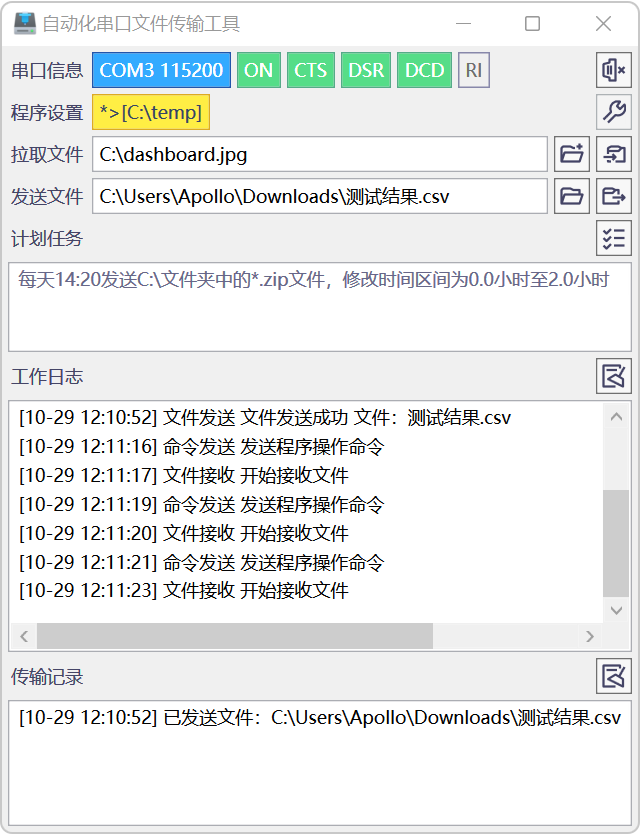
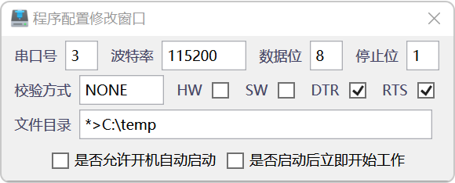
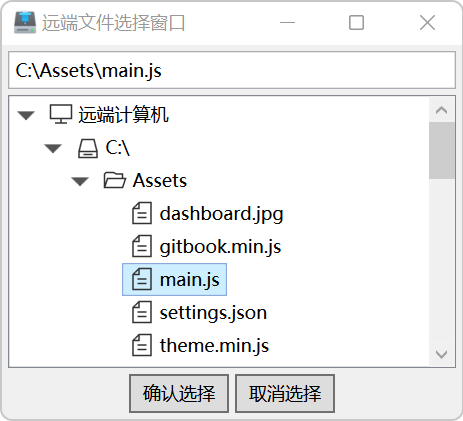
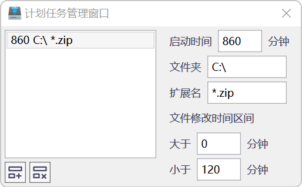

# 自动化串口文件传输工具说明文档

[](https://github.com/Shinerising/ComTransfer/actions/workflows/dotnet-desktop.yml)

[](https://github.com/Shinerising/ComTransfer/releases)


一款支持计算机之间通过串口执行文件发送、文件拉取、自动化文件备份等操作的轻量级软件。



## 软件功能

- 采用`.NET Framework 4.0`开发，支持Windows XP及之后所有的Windows系统，同时支持32位和64位系统；
- 采用广泛使用的串口通信扩展库（PComm Lite）实现串口操作和文件发送功能，工作稳定可靠；
- 采用ZModem文件传输协议，可支持使用最高921600波特率进行传输作业，平均数据传输速度超过100KiB/s；
- 与其他支持ZModem文件传输协议的串口通信工具保持兼容，可互相收发文件；
- 软件支持本地文件选择发送、文件拉取、传输进度显示、串口状态监视、日志记录、程序设置快速修改功能；
- 软件实现了访问远程计算机文件目录树的功能，可手动选取远程计算机中的文件并请求拉取；
- 软件提供计划任务功能，可定时发送固定文件夹中的某类文件至另一台计算机；
- 轻量化开发，用户界面简单易于使用，软件启动速度和执行效率较好。

## 界面说明

软件界面从上至下依次为：

- 串口信息：显示串口参数、启动状态、流状态指示等信息，最右侧为串口启动、关闭切换按钮；
- 程序设置：显示当前的文件存储目录设置信息，最右侧为程序设置按钮；
- 拉取文件：执行远程文件拉取工作，文本框中为远程计算机中文件位置，右侧分别为远程文件选择按钮、文件拉取指令按钮；
- 发送文件：执行文件发送工作，文本框中为本地计算机文件位置，右侧分别为本地文件选择按钮、文件发送指令按钮；
- 计划任务：显示和管理当前已使用的自动化文件传输作业，右侧按钮为计划任务管理窗口启动按钮；
- 工作日志：显示程序的文件操作、指令发送以及其他历史工作内容，右侧按钮为日志清除按钮；
- 传输记录：显示所有成功的文件传输记录，右侧按钮为记录清除按钮；
- 传输进度：显示文件接收与发送进度条和剩余时间信息，默认状态下隐藏。

## 操作步骤

以下介绍常见工作流程的具体软件操作步骤：

### 程序设置

点击程序设置按钮，打开程序配置修改窗口，在此可以设置串口基本参数、流控制参数以及程序相关的其他设置项目。



文件目录是指所收到文件的存储位置，以不同的文件类型作为区分，并按`后缀名>文件目录|后缀名>文件目录`的格式加以记录，星号表示默认文件类型，如以下设置值表示`TXT`文件存储至`C:\Documents`文件夹，其余文件存储至`C:\Downloads`文件夹：

```*>C:\Downloads|.TXT>C:\Documents```

完成设置后关闭该窗口，程序设置会自动记录并更新。

**注意：串口通信开启后无法修改程序配置。**

### 打开串口通信

完成设置后后点击串口通信启动按钮，若通信正常启动，可看到`ON`标志亮起；若未能成功启动，则会在日志列表中显示错误详情。

### 发送文件

点击文件选择按钮，可以打开本地文件选择窗口。选择单个文件后，点击发送按钮即可开始文件传输作业。此时界面上会显示相关工作日志信息以及数据传送进度条。

所发送的文件会自动执行文件压缩过程，因此实际经过串口传送的数据量可能小于原有文件体积。

若某一文件发送工作尚未完成，添加新的文件发送任务后该任务会被放置在缓冲区，等待前一文件发送工作完成或取消后进行发送。

强行关闭串口通信或直接关闭窗口可强制终止未完成的文件发送过程。

### 拉取文件

工具中同时提供从远程计算机拉取文件的功能。在拉取文件一栏的文本框中输入远程计算机的文件地址，点击拉取按钮，程序会自动发出文件拉取指令并接受文件。

为方便寻找远程计算机中的文件项目，工具中提供了浏览远程计算机文件目录树的功能。点击远程文件选择按钮，即可预览和选择目标计算机上的文件。



该窗口中可能无法浏览远程计算机中部分访问受限的文件。同时受限于串口速度，远程计算机文件目录的获取速度可能较慢。

### 使用计划任务

程序中使用计划任务实现自动化文件传输作业，可以指定每一天的某个固定时刻，将本地计算机中某个固定文件夹中符合要求的文件发送至远程计算机。

启动计划任务管理窗口，在此可以对计划任务列表进行编辑。



每条计划任务的属性说明如下所示：

- 启动时间：指示任务触发的固定时刻，以当天0点至目标时刻的分钟数记录（如900分钟即为15:00）；
- 文件夹：待发送文件所存储的目标文件夹；
- 扩展名：用于限定文件发送类型的字符串标记，通常使用后缀名，亦可使用通配符；
- 文件修改时间区间：用于限定文件的修改时间范围，为避免重复发送文件，可根据实际需要指定待发送文件的修改时间区间，如0～120分钟是指任务触发时会发送所有符合要求的、文件修改时间距离当前时刻的分钟数在0至120之间的文件。

窗口左下方分别为任务增加与任务删除按钮。

任务列表编辑完成之后，可之间关闭窗口。所有修改项目将自动记录并重新加载。

## 注意事项

- 文件传输过程为半双工，一方计算机在接受文件时无法同时发送文件，因此不宜同时发送多个文件，以避免数据通信过程长期被占用；
- 为实现较高的文件传输速度，建议使用能够支持较高波特率的通信设备（如NPort、USB虚拟串口等）；
- 受限于串口通信速度，请勿传输体积较大的文件。

## 开发说明

本项目使用了Moxa提供的PComm Lite串口通信软件开发工具中所包含的扩展库文件，相关信息可参见 https://www.moxa.com.tw/product/download_pcommlite_info.htm 。
