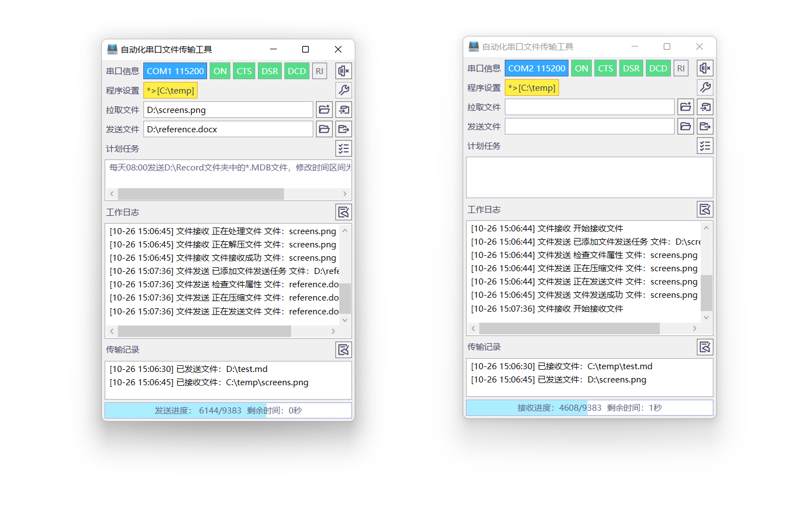

# 自动化串口文件传输工具说明文档

一款支持计算机之间通过串口执行文件发送、文件拉取、自动化文件备份等操作的轻量级软件。

## 软件功能

- 采用.NET Framework 4.0开发，支持Windows XP及之后所有的Windows系统，同时支持32位和64位系统；
- 采用广泛使用的串口通信扩展库（Pcomm Lite）实现串口操作和文件发送功能，工作稳定可靠；
- 采用ZModem文件传输协议，使用NPort设备可使用最高921600波特率进行传输作业，平均数据传输速度超过100KiB/s；
- 软件支持本地文件选择发送、文件拉取、传输进度显示、串口状态监视、日志记录、程序设置快速修改功能；
- 软件实现了访问远端计算机文件目录树的功能，可手动选取远端计算机中的文件并请求拉取；
- 软件提供计划任务功能，可定时发送固定文件夹中的文件至另一台计算机；
- 轻量化开发，用户界面简单易于使用，软件启动和执行效率极高。

## 操作步骤

### 程序设置

### 打开串口通信

### 发送文件

### 拉取文件

### 使用计划任务

## 注意事项

- 为实现较高的文件传输速度，建议使用能够支持较高波特率的通信设备（如NPort、USB虚拟串口等）；
- 受限于串口通信速度，请勿传输体积较大的文件。

## 开发说明

本项目使用了Moxa提供的PComm Lite串口通信软件开发工具中所包含的扩展库文件，相关信息可参见 https://www.moxa.com.tw/product/download_pcommlite_info.htm 。
